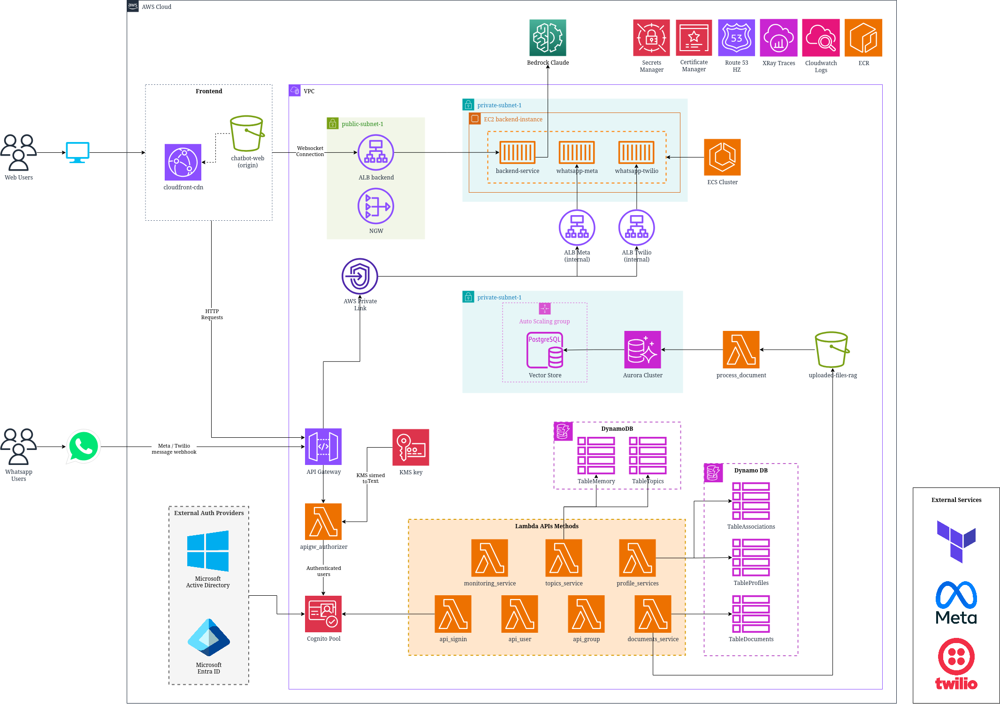
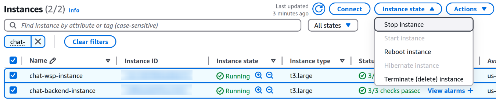
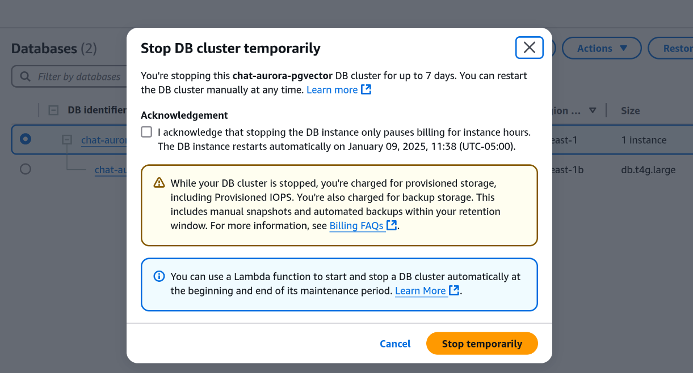

# 00-01 Arquitectura y Precio
## 1. Arquitectura de la Solución

  

---

## 2. Sobre el Precio de la Solución
El precio de esta solución se divide en costos **fijos** y **variables**:

* Los costos **fijos** son definidos por los recursos desplegados en la cuenta, tomando en cuenta los servidores de backend, base de datos, microservicios, etc.
* Los costos **variables** dependen del uso de los modelos GenAI, servicios on-demand de AWS y necesidad de escalabilidad del servicio.

A continuación, se listan las calculadoras estimadas:

* [**Base price:**](https://calculator.aws/#/estimate?id=bd373f3983e1e5dd5aa2439f120fe3f5dd0294c4) a server for the backend, a server for the database and other AWS services.
* [**Base price + Claude 3.5 Haiku**](https://calculator.aws/#/estimate?id=daa502c4190648f7b65a05887e46055468000a0a) base price including an estimate of 500 users x 5 queries/day x 20 days per month using Claude 3.5 Haiku model.
* [**Base price + Claude 3.5 Sonnet**](https://calculator.aws/#/estimate?id=297b3da22d805913b466b03ba611dccaddb7b267) base price including an estimate of 500 users x 5 queries/day x 20 days per month using Claude 3.5 Sonnet model.
* [**Base price + Nova Premier**](https://calculator.aws/#/estimate?id=d4076e79bcb45ae2c69abc51f6d077ac85dcc421) base price including an estimate of 500 users x 5 queries/day x 20 days per month using Nova Pro model.
* [**Base price + WhatsApp**](https://calculator.aws/#/estimate?id=945ebc2b6eb19e9fe201e7022d8edd702fa4afa9) a server for the backend, a server for WhatsApp bot, a server for the database and other AWS services.

---

## 3. Pausar la Aplicación para Ahorrar Costos
Actualmente, Mox AI Chat no cuenta con una característica para pausar los servicios asociados de forma interactiva. Si usted aún desea pausar estos servicios, tendrá que hacerlo de forma manual; recuerde que esto es bajo su responsabilidad. A continuación se detallan los pasos:

> **Precaución**
> * El equipo de Morris & Opazo y el equipo de Mox AI Chat **no recomiendan** el apagado de estos servicios, menos aún si usted como cliente no está familiarizado con la consola AWS.
> * Morris & Opazo y el equipo de Mox AI Chat **no se harán responsables** por cualquier inconveniente que se presente debido a la manipulación de cualquier recurso asociado al proyecto de Mox AI Chat.
> * La incorrecta manipulación de estos recursos podría ocasionar la **pérdida de información** o falla permanente del bot; la reparación de estas fallas ocasionadas tendrá que ser coordinada con el equipo comercial de Morris, teniendo un costo adicional asociado.
> * Recuerde **revertir estos cambios** cuando desee poner en marcha nuevamente la aplicación, ya que esta no mostrará mayor información sobre los servicios no disponibles desde la interfaz web.

### 3.1 Pausar instancias EC2
1. Ingrese a su cuenta de AWS, verifique que se encuentra en la región **us-east-1**.
2. Diríjase al servicio de **EC2**.
3. Seleccione la lista de instancias e identifique las instancias nombradas como **chat-**.
4. También verifique que exista el tag **Project: Chatbot-GO** en estas instancias.
5. Seleccione las instancias y presione el botón de **Actions > Stop instance** como se muestra a continuación.

Esto dejará inoperativo el modelo generativo.

### 3.2 Pausar instancia RDS
1. Diríjase al servicio **RDS** en su cuenta AWS.
2. Luego seleccione el menú **Databases** y observe el clúster nombrado **chat-aurora-vector**.
3. Nuevamente, verifique los tags del recurso como se mostró en la anterior sección.
4. Seleccione el clúster y haga clic en **Actions > Stop temporarily**; lea con detenimiento la pantalla de confirmación.
5. Actualmente, el tiempo máximo de pausa será de 7 días, después el servicio de RDS se encontrará disponible nuevamente.

