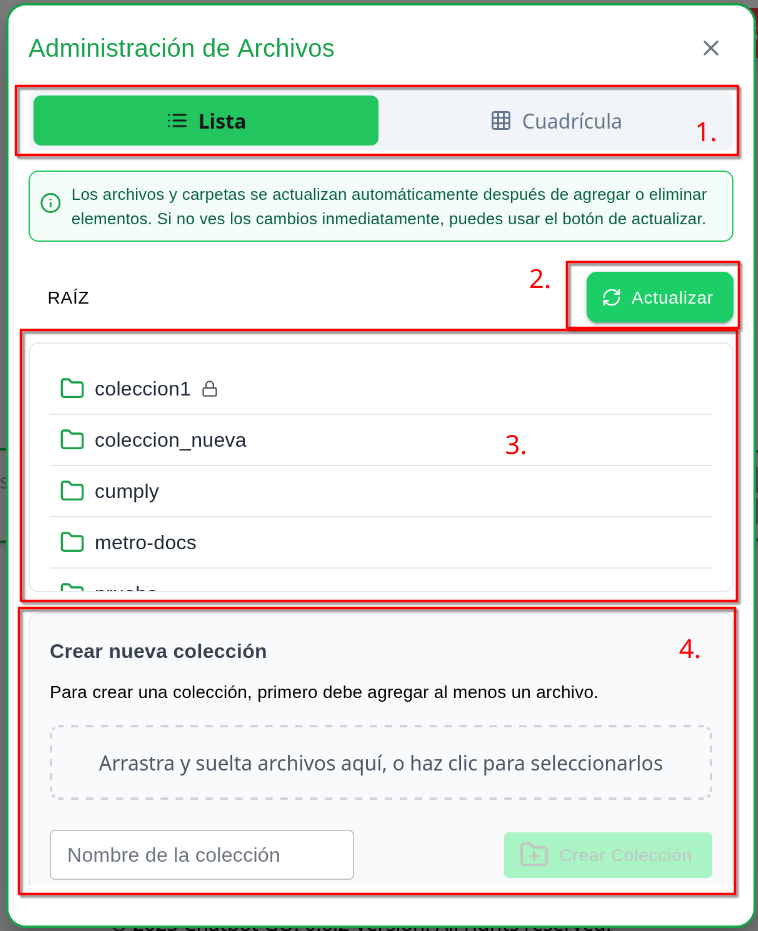
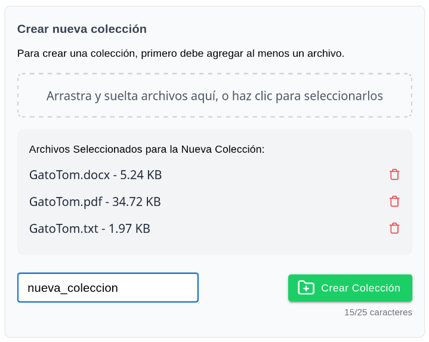
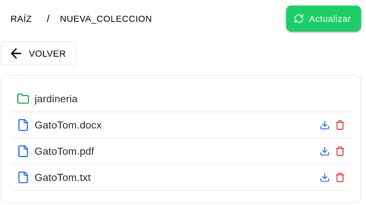

# 20-02-02 Gestión de Documentos
## 1. Menú de Administración de Archivos
1. Diríjase al menú de administración presionando la burbuja con la inicial de su nombre de usuario en la parte superior.
2. Seleccione la opción **Archivos**.
3. Encontrará la vista principal de gestión archivos, la cual tiene los siguientes componentes:
   1. **Modo de visualización:** determina si los archivos se visualizarán como lista o cuadrícula de íconos.
   2. **Botón de actualización:** refresca manualmente la actual lista de documentos para visualizar nuevos cambios.
   3. **Lista de documentos:** se listan colecciones, subcarpetas y documentos. También tendrá la opción de descargar o borrar archivos.
   4. **Subida de archivos:** aquí puede crear colecciones, carpetas y subir documentos.
   

  

## 2. Gestión de Colecciones
### 2.1. Creación de Colección
1. Para crear una colección, ubíquese en la **RAÍZ** de los documentos.
2. Diríjase al menú de **Subida de archivos** en la parte inferior.
3. Especifique un nombre de colección y cargue los archivos desde su computadora.
4. Presione el botón **Crear Colección**.
5. Espere unos segundos para que la vista se actualice, estos documentos se estarán procesando para su consulta.
   

  

> **Importante**  
> - Los formatos soportados para los archivos son: **.txt, .docx y .pdf**
> - Se recomienda un máximo de 100MB por documento.
> - La aplicación no procesa imágenes, tablas o diagramas actualmente.

### 2.2. Creación de Subcarpetas
1. Para la creación de una subcarpeta, ubíquese dentro de una colección.
2. Diríjase al menú **Crear nueva carpeta** en la parte inferior.
3. Especifique un nombre de carpeta y presione el botón **Crear Carpeta**.
4. Ingrese en la carpeta creada y diríjase al menú de **Subida de archivos** en la parte inferior.
5. Cargue los archivos desde su computadora y presione el botón **Subir Archivos**.
6. Espere unos segundos para que la vista se actualice, estos documentos se estarán procesando para su consulta.

  

> **Nota**  
> - El tiempo de procesamiento de cada documento dependerá del tamaño de este. Espere unos segundos antes de poder realizar consultas sobre su documento.
> - Recuerde que no pueden existir documentos repetidos en una misma colección.
> - Puede crear tantas colecciones y subcarpetas como crea necesario.

## 3. Colección Pública
La colección **public** por defecto será persistente, incluso cuando no contenga documentos esta será utilizada para responder preguntas de **usuarios invitados**.

Podrá ubicar esta colección rápidamente mediante el ícono del **candado**, en caso de no encontrarse, verifique su existencia en el menú de archivos. Tiene la capacidad de crearla usted mismo especificando el nombre **public** como colección.

## 4. Eliminación de Documentos
1. Para eliminar un documento diríjase a la colección y subcarpetas que lo contengan.
2. Si una colección o subcarpeta no contiene documentos, se borrará automáticamente al cerrar el menú.
3. Presione el ícono de papelera y confirme la acción.
4. Espere unos segundos hasta que este proceso culmine. Se borrará el archivo en tres ubicaciones: bucket S3, índice de DynamoDB y embeddings de la base de datos vectorial.