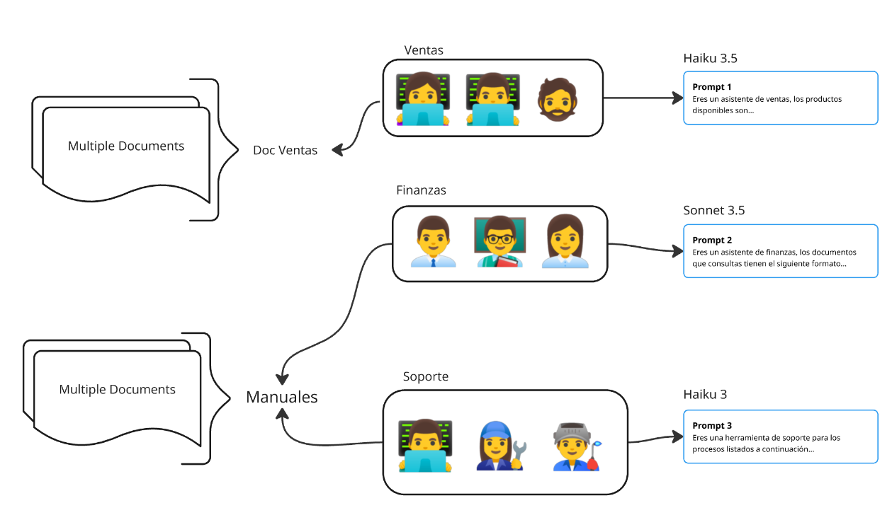
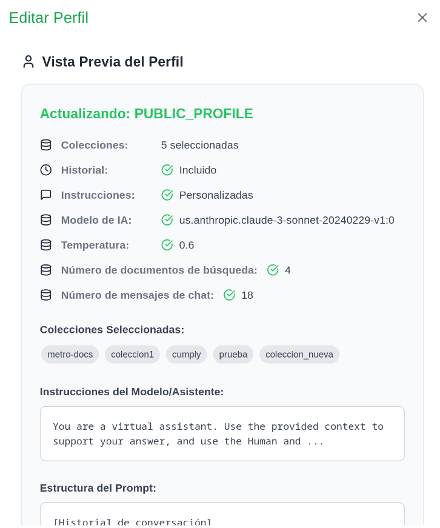

# 20-02-03 Gestión de Perfiles
## 1. Descripción
Los perfiles de usuario son componentes que nos permiten controlar aspectos de la interacción de determinados usuarios con nuestra plataforma. Imaginemos el siguiente escenario, en nuestra empresa tenemos las áreas de ventas, finanzas y soporte. Además, tenemos documentos de ventas y manuales.
Para reflejar este comportamiento en el sistema, podemos hacer lo siguiente:
- creamos **colecciones** de documentos para ventas y manuales.
- creamos **perfiles** homólogos a las áreas de la empresa, y otorgamos el acceso a las colecciones deseadas.

Por medio de la figura de las **asociaciones**, seremos capaces de asignar estos perfiles a los usuarios de distintas áreas. También configuramos el bot para asignarle un rol de soporte, un analista de finanzas o un asistente de ventas, todo esto dentro del mismo entorno de la aplicación.

  

## 2. Atributos
Desde los componentes **perfiles** somos capaces de configurar:
1. **colecciones:** colecciones que a las que el perfil tendrá acceso (public, ventas, soporte, etc.). Estas son leidas directamente de la raíz del menú de archivos.
2. **modelo de IA:** lista de modelos disponibles para interacción con el bot, tiene un impacto directo en la  calidad de respuestas recibidas, pero también en el precio. 
3. **temperatura:** valor en un rango desde 0.0 a 1.0, tiene influencia en el determinismo o creatividad que tiene el modelo al elaborar sus respuestas.
4. **nro. documentos de búsqueda:** cantidad de *chunks* de documentos (considerados relevantes) incluidos en el contexto del modelo al realizar una pregunta (recomendados 4).
5. **nro. de mensajes de chat:** número par representativo de la cantidad de mensajes del historial a las que el bot tendrá acceso por cada pregunta (por defecto 50), también conocido como memoria del modelo.
6. **prompt:** estructura de la información e instrucciones que utilizará el modelo por cada pregunta, se divide de la siguiente forma:
    1. **historial:** historial de mensajes de la conversación actual.
    2. **contexto:** información extraída de los documentos considerados "relevantes" para responder la pregunta del usuario.
    3. **system:** instrucciones directas al modelo (rol, nombre, reglas, ejemplos, consideraciones, etc.).
    4. **pregunta:** pregunta hecha por el usuario

## 3. Creación de Perfil
1. Diríjase al menú de administración presionando la burbuja con la inicial de su nombre de usuario en la parte superior.
2. Seleccione la opción **Perfiles**.
3. Encontrará la vista principal del menú de perfiles, el primer componente que verá es **Creación de Nuevo Perfil**.
4. Introduzca en la caja de texto **Nombre del Perfil** el nombre deseado (sin espacios, use guiones). Presione el botón **siguiente**.
5. En la pestaña de **Configuración** deberá elegir las colecciones a las que tendrá acceso el perfil, es decir, la lista de colecciones que verá el usuario en la parte inferior derecha de la página principal de la aplicación.
6. En la vista de **Instrucciones** podrá configurar los siguientes atributos:
   - **colecciones:** colecciones que a las que el perfil tendrá acceso (public, ventas, soporte, etc.). Estas son leidas directamente de la raíz del menú de archivos.
   - **modelo de IA:** lista de modelos disponibles para interacción con el bot, tiene un impacto directo en la  calidad de respuestas recibidas, pero también en el precio. 
   - **temperatura:** valor en un rango desde 0.0 a 1.0, tiene influencia en el determinismo o creatividad que tiene el modelo al elaborar sus respuestas.
   - **nro. documentos de búsqueda:** cantidad de *chunks* de documentos (considerados relevantes) incluidos en el contexto del modelo al realizar una pregunta (recomendados 4).
   - **nro. de mensajes de chat:** número par representativo de la cantidad de mensajes del historial a las que el bot tendrá acceso por cada pregunta (por defecto 50), también conocido como memoria del modelo.
7. En la vista de **Resumen de Perfil** se listarán las configuraciones hechas previamente, también se mostrará la estructura final del prompt.
   - **prompt:** estructura de la información e instrucciones que utilizará el modelo por cada pregunta, se divide de la siguiente forma:
   - **historial:** historial de mensajes de la conversación actual.
   - **contexto:** información extraída de los documentos considerados "relevantes" para responder la pregunta del usuario.
   - **system:** instrucciones directas al modelo (rol, nombre, reglas, ejemplos, consideraciones, etc.).
   - **pregunta:** pregunta hecha por el usuario.
8. Finalmente presione el botón **Crear Perfil**.

## 4. Edición de Perfil
1. Nuevamente diríjase al menú de administración presionando la burbuja con la inicial de su nombre de usuario en la parte superior.
2. Seleccione la opción **Perfiles**.
3. Esta vez, en la vista principal de este menú, diríjase a la lista inferior de perfiles listada.
4. Presione en el ícono de edición del perfil que se desea editar y siga el mismo proceso descrito en el punto anterior.

  

