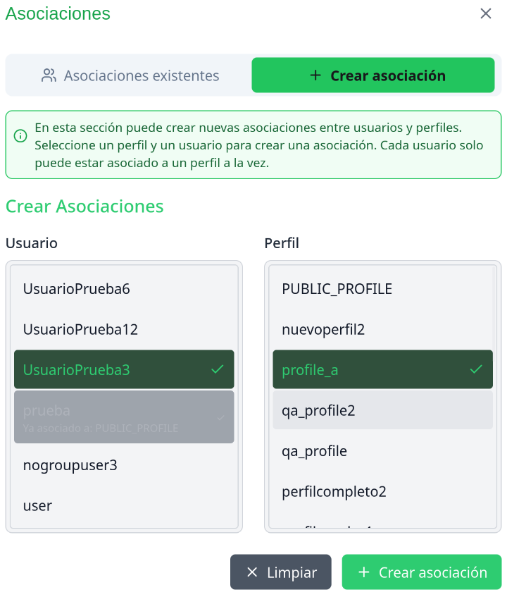

# 20-02-04 Gestión de Asociaciones
# 1. Menú de Asociaciones
La figura de **Asociaciones** nos permite vincular **perfiles** y **usuarios** para que estos últimos puedan interactuar de una forma personalizada con el asistente.

1. Diríjase al menú de administración presionando la burbuja con la inicial de su nombre de usuario en la parte superior.
2. Seleccione la opción **Asociaciones**.
3. Encontrará dos pestañas: **Asociaciones existentes** y **Crear asociación**
4. En la lista de asociaciones tendrá la opción de consultar la asociación de cada usuario y perfil. También podrá presionar en el ícono de papelera para borrar la asociación.
5. En la pestaña de **Crear asociación** se listarán usuarios en la parte izquierda y perfiles en la parte derecha.
6. Seleccione un item de cada lista para crear una asociación.

  

