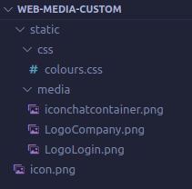
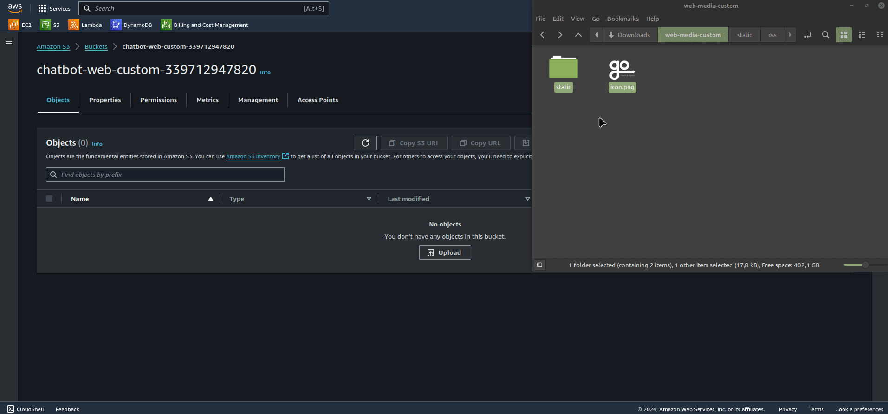
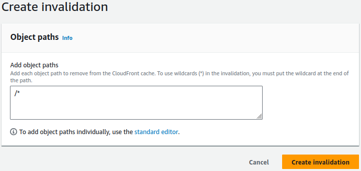

# Personalización de Marca
## Imágenes por Defecto
ChatBot Go! se instala con un conjunto de imágenes predeterminadas que pertenecen a [MorrisOpazo.com](MorrisOpazo.com). Estas imágenes están contenidas en un archivo comprimido denominado [web-media-custom.zip](https://mo-chat-go-artifacts-905418032146.s3.amazonaws.com/web-media-custom/web-media-custom.zip). Este archivo sirve como referencia para conocer el tamaño, nombre, resolución y extensión de las imágenes.

## Pasos para Personalizar Imágenes y Colores
1. **Descarga del Archivo**: Descargue el archivo comprimido [web-media-custom.zip](https://mo-chat-go-artifacts-905418032146.s3.amazonaws.com/web-media-custom/web-media-custom.zip) desde la fuente proporcionada, será necesario haber iniciado sesión en una cuenta AWS.
2. **Descompresión del Archivo**: Descomprima el archivo en su equipo local para acceder a la estructura de referencia, aquí encontrará tanto archivos de imágenes .png como colores de la aplicación en formato .css, vea la siguiente captura:
<p align="center">
  
</p>

3. **Sustitución de Imágenes**: Sustituya las imágenes predeterminadas con las de su propia marca, asegurándose de mantener el mismo nombre, resolución y extensión de los archivos originales.

4. **Sustitución de Colores**: Dentro de la estructura del archivo descomprimido, diríjase a la ruta **/static/css/colours.css**, aquí reemplace los colores predeterminados por valores hexadecimales, siga la siguiente estructura:
```
.COLOUR_LOGIN_BACKGROUND_AND_LEFT_BAR {
    /* Color de menú lateral y fondo de pantalla login */
    background-color: #03588C;
}

.FOOTER_LEFT_BAR {
    /* Color footer de menú latera */
    background-color: #111827;
}

.BORDER_BUTTON_IN_LOGIN {
    /* Color del borde del botón de login */
    border-color: #27496D;
}

.BUTTON_IN_LOGIN {
    /* Color del botón de login */
    background-color: #27496D  !important;
}

.BUTTON_IN_LOGIN:hover {
    /* Color del botón de login al sobreponer el mouse */
    background-color: #2F5A82 !important;
}
```

## Publicación de Marca Personalizada
Una vez que las imágenes y colores hayan sido personalizados a gusto, deberá subirlos a un bucket de AWS S3 específico, manteniendo la estructura de archivos y carpetas del zip. Siga estos pasos:

1. Diríjase al bucket nombrado como `chatbot-web-custom-ID_CUENTA`, donde `{ID_CUENTA}` es el identificador único de su cuenta.
2. Dentro de este bucket vacío arrastre el contenido de su carpeta ´web-media-custom´.
3. Finalmente, confirme la acción de subida y corrobore que las imágenes fueron actualizadas satisfactoriamente en la aplicación web.

> ### Importante
> Es crucial que todos los archivos **mantengan el nombre** y formato **.png** originales para asegurar una integración sin problemas con la aplicación ChatBot Go!



4. Para asegurar que los recursos visuales se actualicen en el cache de CloudFront, será necesario ingresar a [Cloudfront > Distributions](https://us-east-1.console.aws.amazon.com/cloudfront/v4/home?region=us-east-1#/distributions), seleccionar la distribución de ChatBot Go! y crear un **invalidation** como se muestra a continuación.

<p align="center">
  
</p>