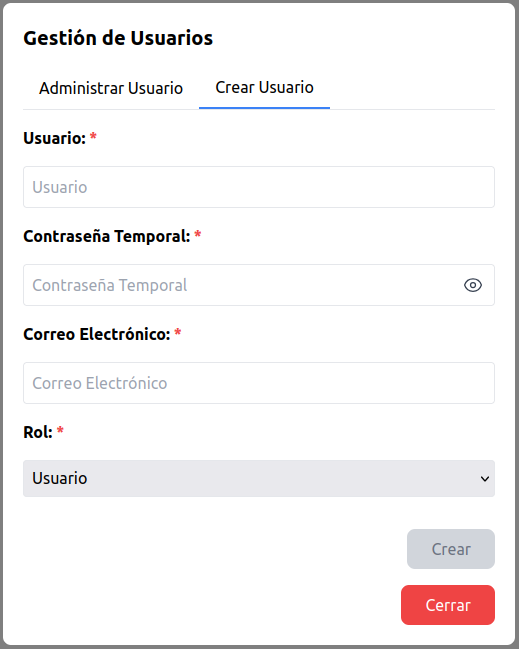
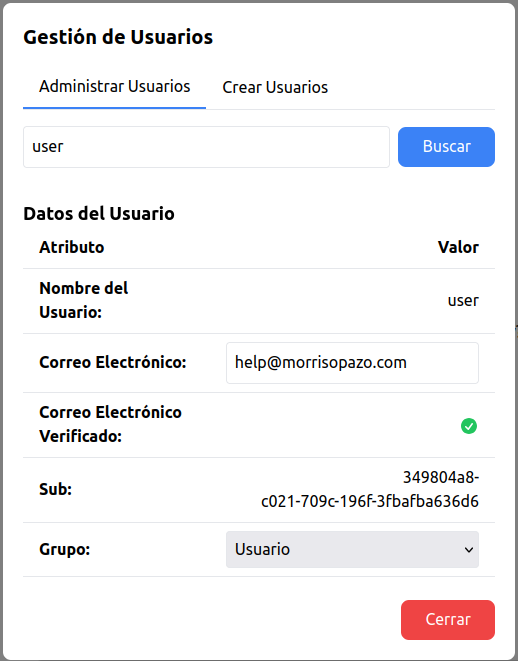
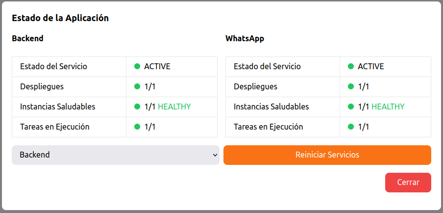
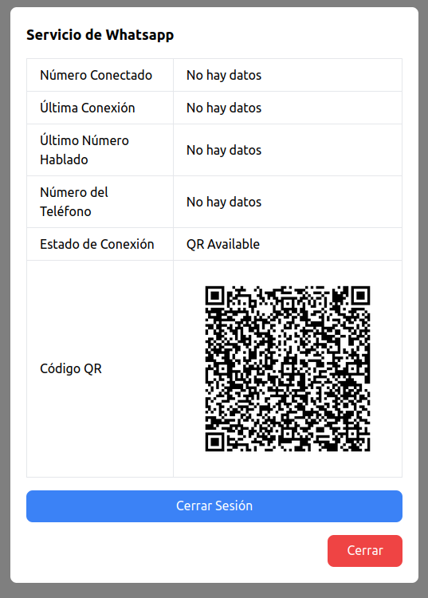
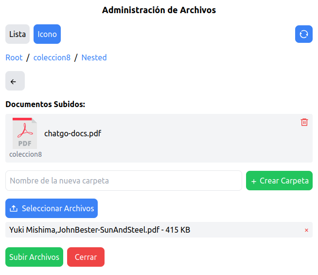
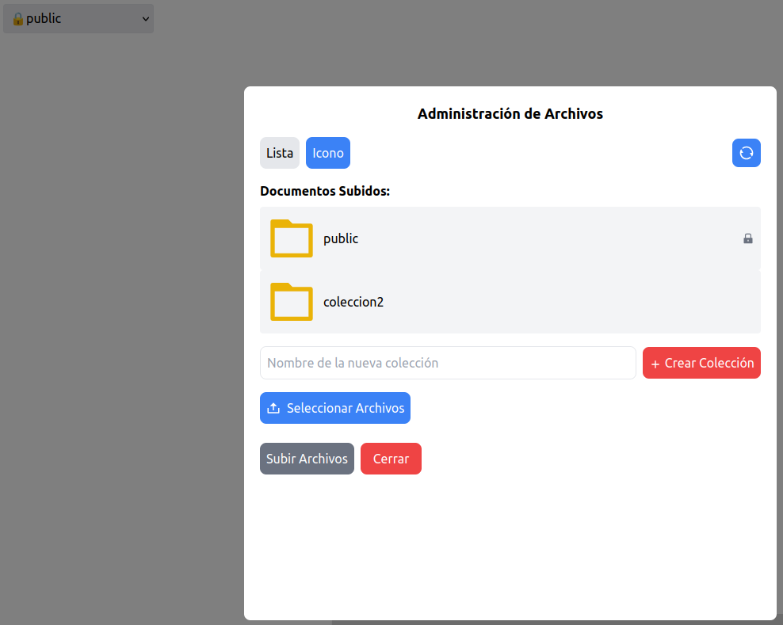

# Acceso a las funcionalidades de administrador
1. Inicie sesión como un usuario administrador. Verá la pantalla principal de ChatBot Go!
2. Diríjase a la parte inferior izquierda de la aplicación, presione el botón **"..."** para abrir el menú de administración.
3. Utilice este menú para acceder a las distintas funciones de administrador explicadas a continuación.

  

# 1 Administración de usuarios
## 1.1 Tipos de Usuario
**Guest (Invitado)**
- No requiere credenciales para interactuar.
- Almacena pero no accede a su historial de conversaciones.
- Puede interactuar con el bot de la misma forma que un usuario convencional, se consultarán los documentos cargados.

**Usuario**
- Acceso mediante credenciales.
- Almacena y puede acceder al historial de sus conversaciones.

**Admin (Administrador)**
- Todas las capacidades del usuario común.
- Capacidad de cargar y borrar archivos que alimentan el modelo de la aplicación.
- Administración de credenciales de otros usuarios.
- Capacidad de configuración del módulo de WhatsApp.
- Capacidad para reiniciar los servicios en caso de fallo.

## 1.2 Creación de un nuevo usuario
1. Diríjase al menú presionando el botón **"..."** en la parte inferior.
2. Seleccione la opción **"Administración de Usuarios"**.
3. Se encontrará en la pestaña **"Crear Usuarios"**, ingrese los datos requeridos.

> ### Nota
> - La primera vez que el nuevo usuario inicie sesión con las credenciales asignadas, se le solicitará cambiar esta contraseña antes de poder hacer uso de la aplicación

  

Si el usuario ya existe, puede realizar algunos cambios sobre él como administrador. Para esto diríjase a la pestaña **"Administrar Usuarios"** e introduzca el nombre de usuario correspondiente.

  

# 2 Menú de Servicio
Esta opción además de tener funciones informativas del estado de la aplicación, también permitirá reiniciar los servicios de su despliegue en caso exista alguna falla.
- **Estado de Backend**: información sobre los recursos que soportan el backend de la aplicación.
- **Estado de Whatsapp**: información sobre los recursos que soportan el servicio de whatsapp de la aplicación.
- **Botón Reiniciar Servicios**: funcionalidad para reiniciar los servicios de backend y whatsapp en caso de que ocurriese una falla.
- **Versión de la Aplicación**: número de versión de ChatBot Go! desplegada en su cuenta.

  

> ### Nota
> - En caso de tener algún problema con la aplicación, se le solicitará una captura de pantalla de esta opción.
> - Cuando envíe un correo electrónico a chatbotgo@morrisopazo.com, además de detallar el problema con la mayor precisión posible, le pedimos que adjunte dicha captura de pantalla.

# 3 Menú de WhatsApp
1. Diríjase al menú presionando el botón **"..."** en la parte inferior y seleccione la opción **"Menú de WhatsApp"**
2. Podrá vincular ChatBot Go! a su cuenta de WhatsApp de dos formas:
   - **Activar Modo Código QR**: Para ser escaneado por la aplicación móvil del teléfono celular, similar al comportamiento de WhatsApp Web.
   - **Activar Modo Emparejamiento**: Aún no disponible.

3. También contará con la opción de desvincular su dispositivo utilizando el botón **"Cerrar Sesión"**

  

> ### Nota
> - Esta funcionalidad solo permite vincular un número a la vez.
> - El flujo conversacional por medio de WhatsApp será igual al flujo de un usuario guest en la aplicación.
> - Esta funcionalidad no incluye una opción para llenado de formularios o intervención humana programada.
> - Es **muy recomendable** contar con un número de WhatsApp exclusivo para comunicaciones con clientes.

# 4 Administración de Archivos
1. Diríjase al menú presionando el botón **"..."** en la parte inferior y seleccione la opción **"Administración de Archivos"**
2. Verá una ventana en la que se muestran las colecciones de archivos como carpetas. Es **requerido** elegir una colección para subir un archivo.
3. Se listarán los archivos incluidos en la colección, tendrá la opción de visualizarlos como lista o íconos.
4. Presione el botón **"Seleccionar Archivos"** y elija algún documento desde su computadora.
5. Presione el botón **"Subir Archivos"**.
6. Espere unos segundos para finalmente observar el archivo subido e interactuar con él.

> ### Nota
> - El tiempo de procesamiento de cada documento dependerá del tamaño de este. Espere unos segundos antes de poder recargar la página y visualizar su documento completamente cargado.
> - Si una colección no contiene documentos, se borrará automáticamente al cerrar el menú.

  

## 4.1 Colección Pública
La colección **public** por defecto será persistente, incluso cuando no contenga documentos esta será visible para el usuario. Esta colección por defecto será la única disponible para **usuarios invitados**, es decir, cualquier información disponible aquí será accesible por usuarios sin cuenta en la aplicación.

Podrá ubicar esta colección rápidamente mediante el ícono de un **candado**.

  

